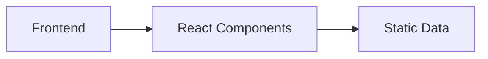

## 1. Architecture Design

## 2. Technology Description
- Frontend: React@18 + tailwindcss@3 + vite
- Initialization Tool: vite-init
- Backend: None (纯静态展示)
- Database: None

## 3. Route Definitions
| Route | Purpose |
|-------|---------|
| / | 电子名片主页 |

## 4. API Definitions
无后端API，使用静态数据

## 5. Server Architecture Diagram
不适用

## 6. Data Model
### 6.1 Data Model Definition
不适用

### 6.2 Data Definition Language
不适用